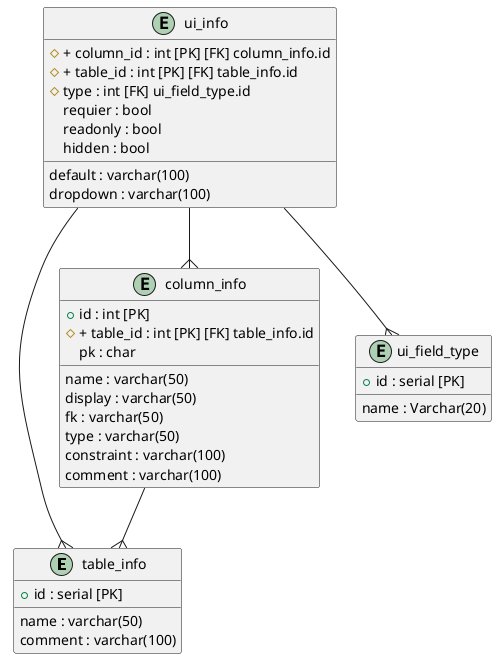

## Table description for database testdb

### Table table_info

table description: Table info

| column | PK | FK | type | display | comment |
|--------|:--:|:--:|------|---------|---------|
| id | ✓ |  | serial |  | ID | table ID |
| name |  |  | varchar(50) |  | Table name | table name |
| comment |  |  | varchar(100) |  | Description | Description of this table |

### Table column_info

table description: Column info

| column | PK | FK | type | display | comment |
|--------|:--:|:--:|------|---------|---------|
| id | ✓ |  | int |  | ID | Column ID |
| table_id | ✓ | table_info.id | int |  | Table id | Table info ID |
| name |  |  | varchar(50) |  | Column name | Column name |
| display |  |  | varchar(50) |  | Dispaly name | Display name for this column |
| pk |  |  | char |  | Key | Is this column a primary key? T | t | “” |
| fk |  |  | varchar(50) |  | Forin key | table.column |
| type |  |  | varchar(50) |  | Column data type | Data type of this column |
| constraint |  |  | varchar(100) |  | Constraint | This column constraint |
| comment |  |  | varchar(100) |  | Description | Description for this column |

### Table ui_field_type

table description: UI field type list

| column | PK | FK | type | display | comment |
|--------|:--:|:--:|------|---------|---------|
| id | ✓ |  | serial |  | Key | ID |
| name |  |  | Varchar(20) |  | Type name | Type name in UI (dropdown |

### Table ui_info

table description: Column info for UI extentions

| column | PK | FK | type | display | comment |
|--------|:--:|:--:|------|---------|---------|
| column_id | ✓ | column_info.id | int |  | Column id | Column info table ID |
| table_id | ✓ | table_info.id | int |  | Table id | Table info tble ID |
| type |  | ui_field_type.id | int |  | Column type | Column type in UI |
| default |  |  | varchar(100) |  | Default value | The default value of the string representation |
| dropdown |  |  | varchar(100) |  | Dropdown | Drop-down list source table name |
| requier |  |  | bool |  | Is requier | Is requier this column |
| readonly |  |  | bool |  | Is read only | Is read only this column |
| hidden |  |  | bool |  | Is hidden | Is hidden this column |

### Table relation

